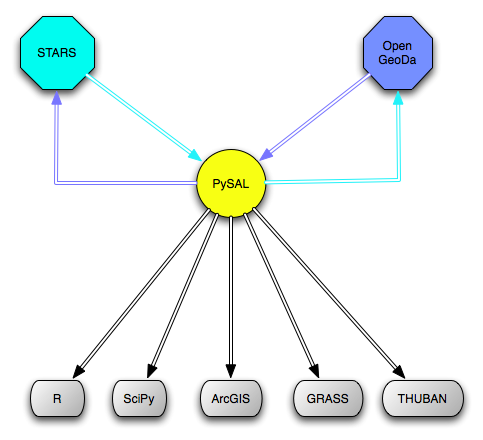

% An Introduction to PySAL: Python Spatial Analysis Library[^talk]
% Sergio J. Rey[^inst]

[^talk]: Draft Chapter for Brunsdon, C. and A. Singleton (eds.) *Geocomputation: A Practical Primer*. Sage Publications

[^inst]: GeoDa Center for Geospatial Analysis and Computation, School of
Geographical Sciences and Urban Planning, Arizona State University.
<srey@asu.edu>

**INCOMPLETE DRAFT**

**NOT FOR QUOTATION WITHOUT PERMISSION OF THE AUTHOR**

**COMMENTS WELCOMED**

# Introduction

This chapter represents an update of progress on the Python Spatial Analysis Library (PySAL) originally introduced in @Rey:2007ox.  PySAL's was born of a collaboration between two earlier projects: PySpace and GeoDa developed at the XXX directed by Luc Anselin, and the STARS project that was directed by the author at San Diego State University. The collaboration was born out of a recognition that by pooling the efforts of the two labs, a good deal of duplication of effort could be avoided since the constituent projects were relying on a number of common core algorithms, data structures, and related modules. Rather than each group implementing the same algorithm, shared developer resources could be used to implement a single version of the algorithm for the library which each group could then leverage in their own projects. Additionally, by providing the code via a library, it now became open to a much wider user community beyond the two project groups.

In 2008, Rey joined Anselin in the GeoDa Center for Geospatial Analysis and Computation at the Arizona State University. This ushered in a number of important changes in how the project was organized. First, we moved away from internal development of the code base to a more open structure by  centralizing the code repository at Google Code under a BSD license. This was shortly followed by the adoption of a fixed, six-month release cycle, with the first release of PySAL 1.0 in July 2010. 

move to github

adoption by anaconda

The remainder of this chapter is organized as follows. The key modules that comprise the library are described. This is followed by an overview of the different delivery mechanisms for PySAL that span the gamut from interactive prompts, to toolkits for GIS packages, GUI based exploratory spatial and space-time packages, and through high performance computational gateways and web services. Next the focus shifts to an illustration of one particular module in PySAL: the spatial dynamics module where a selection of the analytics are applied to a case study of XX. The chapter ends with some comments about future directions for PySAL.

# PySAL Components

PySAL is designed as a modular library with individual components focusing on suites of analytical methods, data structures and algorithms related to a particular type of spatial or space-time analysis. Figure XX provides a high level view of the key modules in PySAL.

## Spatial Weights.
At the core of many spatial analytical techniques is formal representation of neighbor relations between observations embedded in geographical space. There are a wealth of approaches to defining these relations and the weights module implements many of the most widely used, as well as lesser known, methods. Given their centrality in analysis, efficiency in memory footprint and computations involving the weights has been a high priority of our development.
## Computational Geometry.

## Clustering.

## Exploratory Spatial Data Analysis (ESDA).
Methods for global and local spatial autocorrelation analysis form the core of the PySAL ESDA module. The global methods include the analysis of binary outcomes via join count statistics with inference based on both normal approximations as well as permutation based approaches. For continuous variables, global version of Geary's C, Moran's I and the Getis-Ord G statistics are included, again with multiple approaches to inference.  Local autocorrelation statistics include the local Moran and LISA statistics, and local versions of the Getis-Ord G statistics.

In addition the these standard measures for autocorrelation analysis, the ESDA module also includes bivariate Moran statistics as well as a suite of approaches for continuous variables that are rates, expressed as a ratio of the count of some event over a population at risk,  where special care is needed due to variance instability of the attribute reflecting heterogeneity in the population at risk over the enumeration units.

## Spatial Dynamics.
The spatial dynamics module initially was based on the space-time analytics from STARS but has grown with the addition of a number of newly developed methods. 

## Spatial Econometrics.

# Use cases

By design PySAL as a library is intended to support a variety of delivery mechanisms and use cases. This is a recognition of the diversity of end users, computing platforms and XX that spatial analytical services are consumed on.

#### Interactive computing
In many areas of scientific investigation, often one does not have a clear hypothesis in mind and instead adopts an exploratory, or data driven, approach to the analysis. Here the use of an interactive prompt is invaluable as the ultimate scientific workflow is not readily apparent, and instead, the next computational task that the research will apply is only known after the results of the previous step are generated.

Many times in exploratory spatial data analysis, one is 
interactive prompt

#### Graphical User Interface Clients

A second use case the PySAL supports is the wrapping of components of the library in rich desktop clients which provide access to the underlying functionality through a user-friendly graphical user interface (GUI).

#### GIS Toolkits

In addition to interactive shells and GUI clients, users can interface with PySAL through toolkit architectures of geographic information systems (GIS) such as ArcGIS and QGIS.

#### Web Services

The final delivery mechanism  for PySAL is through web services. This can take on a variety of forms

hpc environments

distributed computing

CGPySAL

Meta Data

# Illustration

Given the scope of the modules in PySAL space limitations prevent an exhaustive set of illustrations. Instead I focus a select number of applications that have used PySAL for different types of substantive problems.
The case study focuses on the dynamics of homicide patterns in XX US states using data developed by @Baller:2001aa.

Figures XX-XX show choropleth maps for the homicide rates (HR=homicides per 100,000) for the decades of 1960-1990. The classification method is one of the options in the PySAL map classification module and it is used here with the vizualization module which is a contributed module. The latter are user inspired modules that are not formally part of the core PySAL library but provide a way for users to extend the library for particular use cases. 

problem intro

maps

Examination of the class boundaries indicates that the lower four quintiles are fairly stable over the four decades, while the maximum value is highest in the first decade, drops in the intermediate two decades and then rises up to XX in 1990. An a-spatial view of the distribution dynamics is portrayed in XX suggests that the overall level of homicide was actually lower in the first and last decade, relative to the middle two decades if the median is considered. 

Applying Moran's $I$ to the homicide rates for each decade reveals significant positive spatial autocorrelation and these measures are robust to choice of the spatial weights matrix (rook versus queen) in all periods.

Table with I EI psim.

The global measures of autocorrelation are similar over this period suggesting that the pattern of homicide activity may be relatively stable. Similarly, the stability of the majority of the quintiles may also be interpreted as evidence of distributional stability. However, both sets of measures are global, or whole map, measures that may mask more complex dynamics at work *within* the distribution.  PySAL's spatial dynamic module has a number of space-time analytics that consider the role of space in the evolution of distributions over time. 

The first of these is based on a classic discrete Markov chain which uses the quintiles to define the states of the chain. More specifically, the homicide rate in each county is viewed as a sample chain that can take one of five discrete values corresponding to its position in the quintile distribution in a given year. By pooling all the sample chains, the probability transition matrix can be estimated via maximum likelihood as:

$\hat{p}_{i,j} = \frac{\sum_t n_{i,j,t}}{\sum_t \sum_j n_{i,j,t}} $

where $n_{i,j,t}$ is the number of times a sample chain was in state $i$ in period $t$ and state $j$ in the next period. Applying this estimator to our sample chains gives the following estimated transition probability matrix:

	0.431&0.253&0.128&0.099&0.088
	0.240&0.291&0.241&0.145&0.083
	0.154&0.214&0.277&0.221&0.135
	0.106&0.150&0.215&0.271&0.258
	0.071&0.091&0.138&0.263&0.438

There is strong evidence of mobility in the homicide rate distribution as the probability of remaining in the same quintile over sequential decades is less than 0.50 for all quintiles. The mobility is higher for the intermediate quintiles than is the case for the first and last quintiles. Lower mobility for the fifth class is to be expected given the skewed nature of the homicide rate distribution in each decade which results in a wider interval for that state in the Markov chain. Interval width alone, however, does not account for the lower mobility in the first quintile as its width is similar to that of the fourth quintile.

The classic discrete Markov chain provides a first view of the distributional dynamics, however, it does not consider the spatial location of the sample chains and how the local context of a county might effect the chain's movement in the distribution and transitions across states. One approach to consider this is the spatial Markov chain which conditions the transition dynamics of a county's homicide rate the spatial lag of homicide rates.

# Conclusion

Recap
Future Directions

provenance and meta data

# References

# Further Reading

